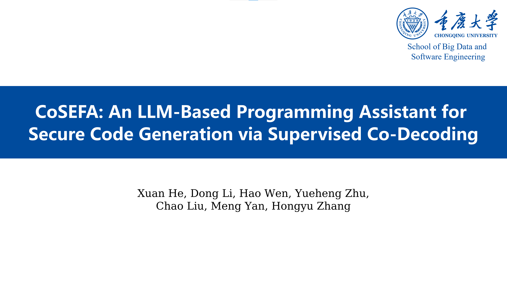

This project is the open-source repository of CoSEFA, containing the backend demo and programming assistant plugin demo of CoSEFA.

---

### Video Demonstration

---

### About Our Work

#### CoSec

GitHub: https://github.com/Nero0113/CoSec

Paper: https://doi.org/10.1145/3650212.3680371

Cite: Li D, Yan M, Zhang Y, et al. CoSec: On-the-Fly Security Hardening of Code LLMs via Supervised Co-decoding[C]//Proceedings of the 33rd ACM SIGSOFT International Symposium on Software Testing and Analysis. 2024: 1428-1439.

#### LlmFix

GitHub: https://github.com/YXingo/LlmFix

Paper: https://arxiv.org/abs/2409.00676

Cite: Wen, H., Zhu, Y., Liu, C., Ren, X., Du, W., & Yan, M. (2024). Fixing Code Generation Errors for Large Language Models. arXiv preprint arXiv:2409.00676.
